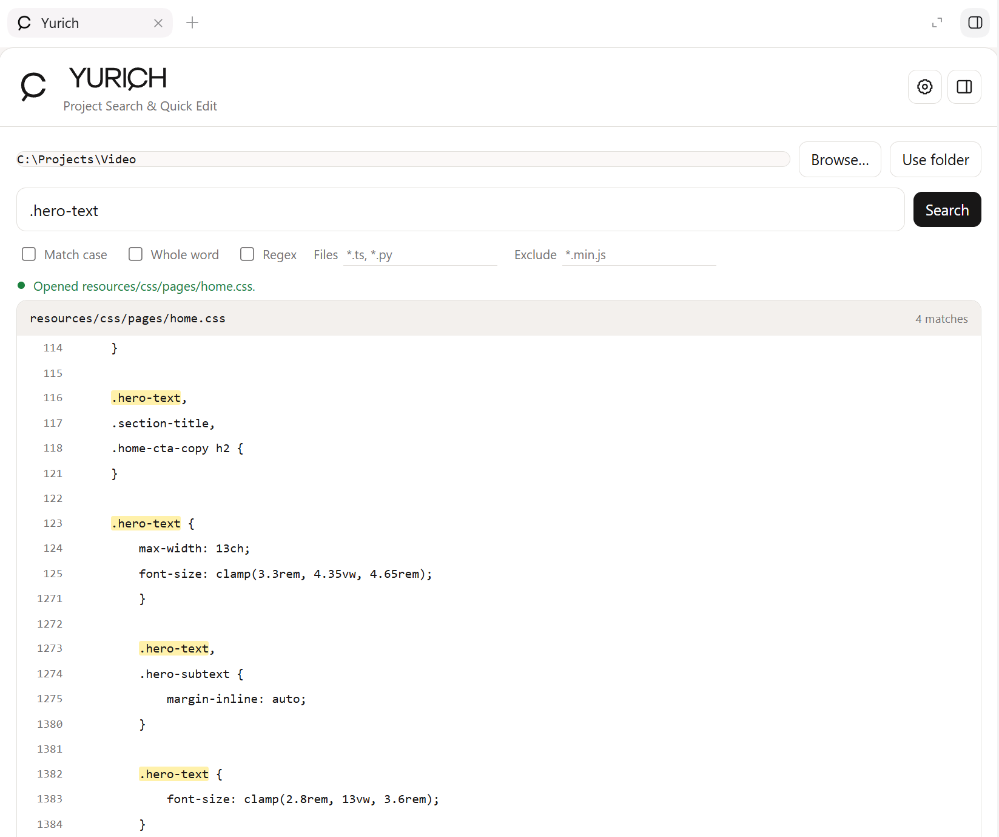
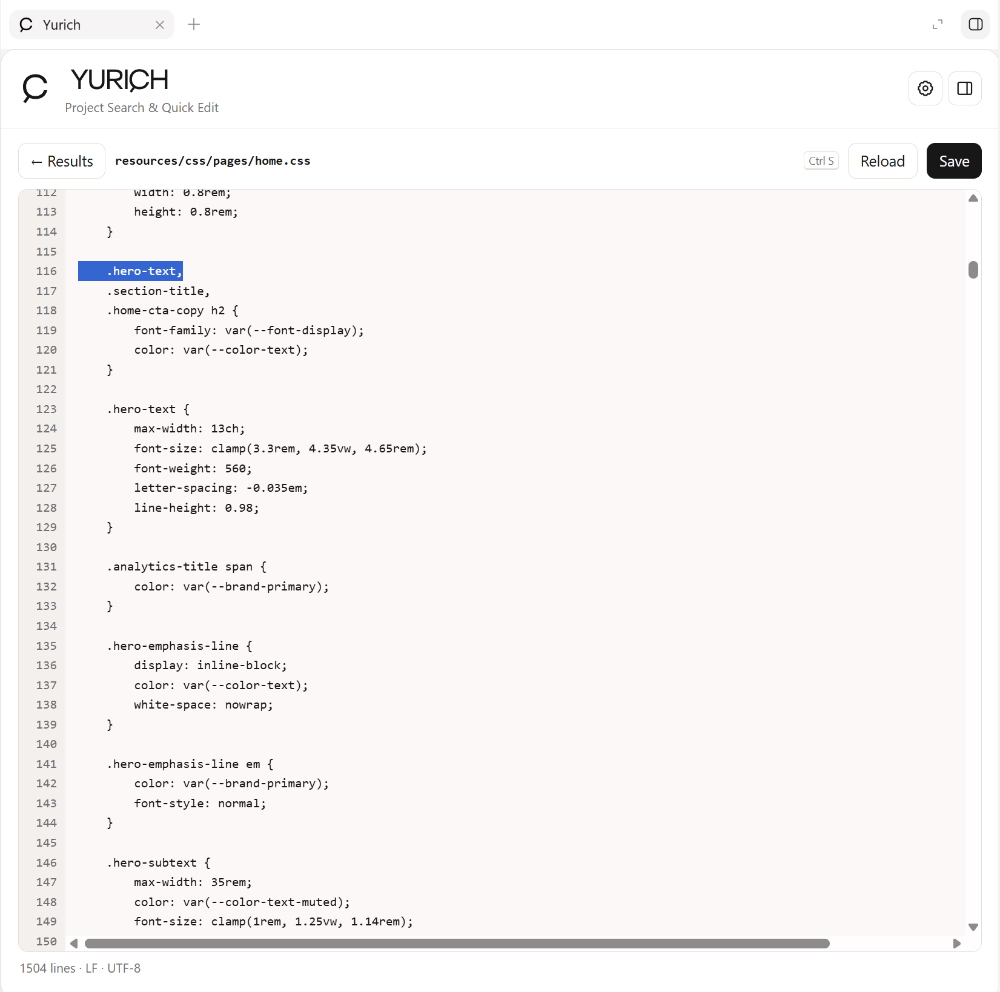
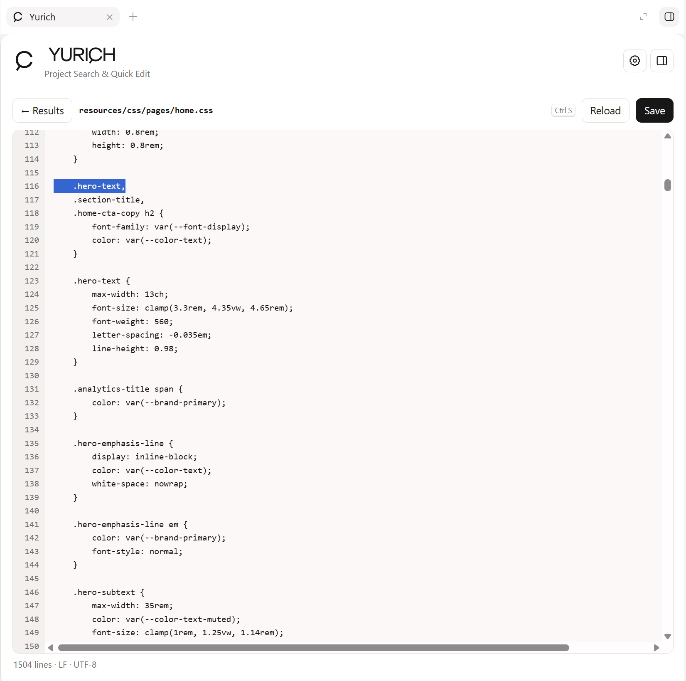

<p align="center">
  
</p>

<p align="center">
  <strong>Fast local search and careful manual editing for Codex.</strong>
</p>

<p align="center">
  Search any local folder, inspect matching code, and make focused edits without leaving Codex.
</p>

YURICH is a small local Codex plugin that lets you choose any folder on your
computer, search its text files, inspect the surrounding code, and make focused
edits without switching to a separate editor. The selected folder does not have
to be the project attached to the current Codex task.

YURICH is intentionally modest: it is built for finding a selector, phrase,
function, setting, or other fragment and changing the exact file by hand. It is
not a bulk refactoring tool and it never edits search results automatically.

## Highlights

- **Search any folder** by entering an absolute path or using the native folder
  picker on Windows.
- **Fast text search** through ripgrep when available, with a built-in Python
  fallback.
- **Useful filters** for case sensitivity, whole words, regular expressions,
  included file globs, and excluded file globs.
- **File-name search** for locating a file by its name or relative path without
  searching its contents.
- **Readable results** grouped by file, with matching text highlighted and
  a configurable number of nearby lines shown for context.
- **Inline editor** with line numbers, match navigation, tab insertion, reload,
  and `Ctrl+S` saving.
- **CSS variable lookup** that finds the declaration of the custom property
  under the editor cursor or inside the current selection.
- **Conflict protection** that stops a save when the file has changed on disk
  since it was opened, plus warnings before unsaved edits are discarded.
- **Persistent workspace** with search history, recent folders, favorite
  folders, filters, context size, theme, and preferred editor font size.
- **Flexible layout** that can remain inside the task or open in the Codex side
  panel.

## Screenshots

### Project search



### Quick editor



### Preferences and saved folders



## Typical workflow

1. Start a new Codex task after installing or updating the plugin.
2. Ask `Open YURICH` or `Открой YURICH`.
3. Enter an absolute folder path, or select one with **Browse…**.
4. Choose **Use folder**, enter a query, and select **Search**.
5. Select a result to open the file.
6. Make a small edit and save it with **Save** or `Ctrl+S`.

The settings button controls the editor font size, context line count, and
light/dark/system theme. Fresh installations start with common minified files
and source maps excluded; the exclusion field remains editable.

## Safety model

YURICH performs search, read, and write operations locally through its MCP
server. It does not require a hosted service or an external account.

- A folder must be selected explicitly before files can be accessed.
- File operations are restricted to paths inside that selected folder.
- Parent traversal and symlink escapes are rejected.
- The editor accepts UTF-8 text files up to 8 MB.
- Saves use a temporary file followed by an atomic replacement.
- A changed-on-disk check prevents silent overwrites of newer file versions.
- Common generated directories such as `.git`, `node_modules`, `dist`, `build`,
  and `vendor` are skipped during search.
- There are no rename, delete, bulk-replace, or automatic-edit actions.

On Windows, saved interface preferences are stored in
`%LOCALAPPDATA%\YURICH\state.json`.

## Requirements

- Codex desktop with local plugin and MCP support
- Python 3.10 or newer
- Windows for the native folder picker
- Optional: [ripgrep](https://github.com/BurntSushi/ripgrep) for faster searches

Manual absolute-path entry works on other platforms supported by the Python
server, although the current installation flow is primarily tested on Windows.

## Local installation

1. Clone or copy this repository to a permanent folder.
2. Open `.mcp.json` and set the Python script path to the absolute location of
   `server/yurich_mcp.py` on your computer.
3. From the repository root, add its local marketplace:

   `codex plugin marketplace add .`

4. Install YURICH:

   `codex plugin add yurich@personal`

5. Open a new Codex task so the updated MCP server and interface are loaded.

The checked-in `.mcp.json` may contain the path used by the original local
development installation. Change it when the repository is moved or cloned to
another computer.

## Development

The MCP server uses only the Python standard library. The interface is a single,
dependency-free HTML file.

Run the automated tests from the repository root:

```powershell
python -m unittest discover -s plugins\yurich\tests -v
```

Validate the plugin with the `validate_plugin.py` helper supplied by the Codex
`plugin-creator` skill:

```powershell
python <path-to-plugin-creator>/scripts/validate_plugin.py plugins/yurich
```

## Current limitations

- The editor is deliberately lightweight and does not provide full IDE-style
  syntax highlighting or language intelligence.
- Native folder selection is currently Windows-only.
- Very large or non-UTF-8 files are not opened for editing.
- The button labelled **Open side panel** relies on the display modes supported
  by the current Codex desktop build.

## License

YURICH is licensed under the [Apache License 2.0](LICENSE). You may use, modify,
and redistribute it under the terms of that license.
